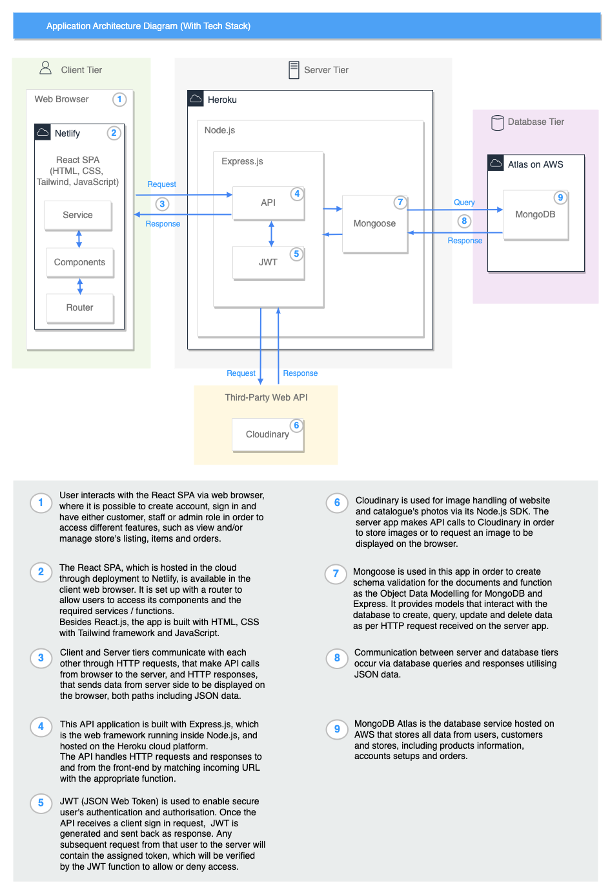

<!-- omit in toc -->
# T3A2-A Full-Stack App (Part A)
<!-- omit in toc -->
## Desperate Housewares App
___
<!-- omit in toc -->
### Table of Contents
- [Problem Identified](#problem-identified)
- [Purpose](#purpose)
- [Target Audience](#target-audience)
- [User Stories](#user-stories)
- [Features](#features)
- [Tech Stack](#tech-stack)
- [Dataflow Diagram](#dataflow-diagram)
- [Application Architecture Diagram](#application-architecture-diagram)
- [Wireframes](#wireframes)
- [Trello Board Progress](#trello-board-progress)

### Problem Identified

People do not know what is in at an op shop until they go in there, and most of the time you need to browse in several stores until you find a desired product. For convenience people trend to go to bigger op shops, which normally belong to a chain of stores, leaving only a small portion of the market share for the community stores. Due to the limited market presence and visibility, those smaller op shops sometimes end up not having enough volume of sales to become a sustainable business that continuous to support the local economy and the underprivileged customers.

### Purpose

This web application has the main purpose of giving a better market visibility to small op shops by displaying their catalogue of products to be easily accessed by their customers, who can verify online if their local store has the items they are looking for and complete the purchase for pick up, saving time and money in their purchasing process, as it eliminates the need to physically go and browse for an item in several different stores.

### Target Audience

* Customers - local community, underprivileged people
* Small op shops - administrator and general staff

### User Stories

* Customers (users and shoppers): 

As a user, I want to be able to view a store's list of products or catalogue so that I can find an item.

As a user, I want to be able to sign up/create account so I can utilise the website features.

As a user, I want to be able to delete my account because I no longer want to use this service.

As a user, I want to be able to update my account so that changes in my details are current.

As a user, I should be able to log into my account so that I can use the website as desired.

As a user, I want to be able to recover my password so that I can log in if I forget it.

As a shopper, I want to be able to view listings I have placed on hold so that I can manage them. 

As a shopper, I want to be able to pay online for a listing item so that it can be held at the store for me to collect. 

As a shopper, I want a confirmation email for the product so that I know all the details.

* Administrator:

As an administrator, I want to be able to add a user to a store as staff so that they can post product listings in the store's catalogue. 

As an administrator, I want to be able to do all the things that a staff member can do so that I can also perform staff tasks.

As an administrator, I want to be able to remove staff from the store because they no longer work there. 

* Staff member:

As a staff member, I want to be able to add products to a store's catalogue so that shoppers can place an order on them.

As a staff member, I want to be able to see a list of products on hold so that they can be organised for the shopper. 

As a staff member, I want to be able to remove product listings so that they are no longer shown on the stores catalogue.

As a staff member, I want to be able to update a products listing so that changes can be added/removed from the listing.

* Non-MVP User Stories: 

As a user, I want to be able to view a list of stores so that I can find a store close to me. 

As a user, I want to be able to search a store's catalogue using keywords so that I can find relevant listing items.

As a shopper, I want to be able to see a calendar for how long I have left to collect an item before it is no longer placed on hold.

As a shopper, I want to be able to chat to the store's staff about listing items so that I can get more information about them.

As an administrator, I want to be able to create a store so that it can support its own catalogue. 

As an administrator, I want to be able to view my sales over a timeframe as well as track transactions so that I can gain insights on my business goals.

As a staff member, I want to be able to see the items on hold and their details in my calendar so that I can efficiently manage them.

As a staff member, I want to be able to chat to shoppers who are requesting to find out more information about a listing item.

### Features

* Payment system
* Multi-stores
* Communication
* Admin dashboard
* Calendar
* Searching

### Tech Stack

### Dataflow Diagram
The dataflow diagrams (DFD) reflects the movement of data throughout the program.Rather than have one large diagram, they have been split into multiple DFDs to make understanding them easier.

They have been broken down to specific processes:
- Customer/User
- Staff
- Manager/Admin
- Login/Sign Up
- Cart

The customer/user DFD follows the processes required for the basic usage of the app; Viewing the items, adding the items to their cart, and placing the items on hold. In order for a customer to add an item to their cart they are required to be logged in.

The cart DFD shows the processes involved in either placing an item on hold or removing all items from the cart. Once the items are placed on hold they are removed from the catalogue so they aren't visible to other customers, the items are moved into their orders, and the cart is then cleared. If the user wishes to clear their cart with placing on hold then the cart is simply cleared of all items.

The login/sign up DFD follows the process required for logging in with JWT and Bcrypt. Each step requires some form of verification (all required inputs are provided, if the user exists, etc.). Once the user is verify or the new user is signed up, the user info is stored as a session cookie and provided a token specific to the user and session which can then be accessed for the duration of the session.

The staff DFD reflects the process of adding, editing, and deleting an item. Only staff, managers, and admins have access to these features.

The manager/admin DFD shows that they are the only ones with access to the admin dashboard. The admin dashboard is the only place where the role of an account can be edited (i.e. add or remove staff). They also have access to all features available to staff.

### Application Architecture Diagram

### Wireframes

### Trello Board Progress

